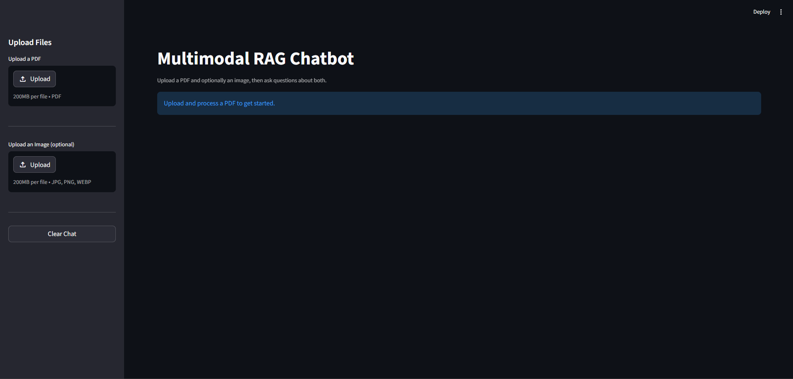

# Multimodal RAG Chatbot

A document intelligence chatbot that answers questions about **PDFs and images** using Retrieval-Augmented Generation (RAG) powered by Google Gemini.

Upload any PDF, ask questions in natural language, and optionally attach an image to get answers that combine both sources — with full source attribution.

---

## Demo

> Upload a PDF → Ask questions → Get grounded answers with sources



---

## Features

- **PDF Ingestion** — Upload any PDF and have it indexed instantly
- **Semantic Search** — Finds the most relevant chunks using vector similarity
- **Image Understanding** — Attach an image and ask questions about it alongside your document
- **Conversational UI** — Clean chat interface with full history
- **Source Attribution** — Every answer shows exactly which pages it came from
- **Grounded Answers** — Model only answers from your content, no hallucination

---

## Tech Stack

| Layer         | Technology                   |
| ------------- | ---------------------------- |
| LLM & Vision  | Google Gemini 2.0 Flash Lite |
| Embeddings    | Google Gemini Embedding 001  |
| Vector Store  | ChromaDB                     |
| RAG Framework | LangChain                    |
| PDF Parsing   | PyMuPDF (fitz)               |
| UI            | Streamlit                    |

---

## Getting Started

### 1. Clone the repo

```bash
git clone https://github.com/YOUR_USERNAME/multimodal-rag-chatbot.git
cd multimodal-rag-chatbot
```

### 2. Create a virtual environment

```bash
python -m venv venv
venv\Scripts\activate       # Windows
source venv/bin/activate    # Mac/Linux
```

### 3. Install dependencies

```bash
pip install -r requirements.txt
```

### 4. Set up your API key

Create a `.env` file in the root directory:

```
GEMINI_API_KEY=your_gemini_api_key_here
```

Get a free API key at [aistudio.google.com](https://aistudio.google.com)

### 5. Run the app

```bash
streamlit run app.py
```

---

## Project Structure

```
multimodal-rag-chatbot/
├── app.py                  # Streamlit UI
├── rag_pipeline.py         # PDF loading, chunking, embedding, QA chain
├── vision_pipeline.py      # Image encoding, Gemini Vision, multimodal QA
├── requirements.txt        # Dependencies
├── .env                    # API keys (not committed)
└── .gitignore
```

---

## How It Works

1. **PDF is loaded** page by page using PyMuPDF
2. **Text is chunked** into 500-character overlapping segments
3. **Chunks are embedded** using Gemini Embedding and stored in ChromaDB
4. **On each question**, the top 4 most relevant chunks are retrieved
5. **If an image is attached**, Gemini Vision describes it in detail
6. **Gemini LLM** synthesizes the retrieved chunks + image description into a final answer

---

## Environment Variables

| Variable         | Description                   |
| ---------------- | ----------------------------- |
| `GEMINI_API_KEY` | Your Google AI Studio API key |

---

## License

MIT License — feel free to use and build on this.
